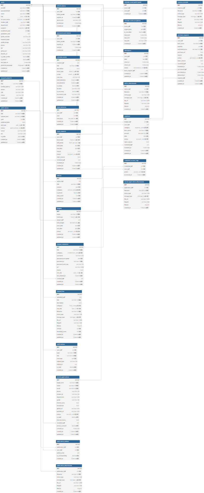

# 🚀 Lab-Hub Backend

우리 연구실(Lab)의 효율적인 운영을 위한 통합 관리 시스템 백엔드입니다.

## 🛠 Tech Stack
- **Language**: Node.js
- **Framework**: Express.js
- **Database**: PostgreSQL
- **Environment**: dotenv, nodemon

## 📂 Project Structure
우리는 기능을 기준으로 폴더를 분리하여 협업합니다.
lab-hub-backend/

├── src/

│ ├── config/ # DB 연결 및 환경 설정

│ ├── controllers/ # API 요청 처리 로직

│ ├── models/ # DB 테이블 구조 정의

│ ├── routes/ # API 경로 설정

│ └── index.js # 서버 실행 파일

├── .env # 환경 변수 (공유 금지)

└── package.json

## 🗄 Database Schema
ERD:

현재 구현된 `users` 테이블은 다음과 같은 구조를 가집니다.
- **인증/권한**: id, email, password_hash, role, account_status
- **학사 정보**: student_id, department, program, enrollment_year
- **프로필**: name, research_topic, bio, github_url 등

## 🤝 Collaboration Guidelines (중요!)
우리는 **Git**을 사용하여 협업하며 다음 규칙을 준수합니다.

1. **Branch 전략**
   - `main`: 항상 배포 가능한 상태를 유지합니다.
   - `feature/기능명`: 각자 기능을 개발할 때 사용하는 브랜치입니다. (예: `feature/user-auth`, `feature/calendar`)

2. **작업 순서**
   1. `git checkout main` -> `git pull` (최신 상태 유지)
   2. `git checkout -b feature/기능명` (내 작업실 생성)
   3. 코드 작성 및 기능 구현
   4. `git add .` -> `git commit -m "feat: OOO 기능 구현"`
   5. `git push origin feature/기능명`
   6. GitHub에서 **Pull Request (PR)** 생성하여 코드 리뷰 요청

3. **기능 분리**
   - 각자 담당한 기능을 자기만의 파일(`controllers/내파일.js`)에 작성하여 충돌을 방지합니다.

## 🚀 Getting Started
1. 저장소 클론: `git clone [저장소 주소]`
2. 라이브러리 설치: `npm install`
3. 환경 변수 설정: `.env` 파일을 생성하고 DB 접속 정보를 입력합니다.
4. 서버 실행: `npm start` (또는 `nodemon src/index.js`)